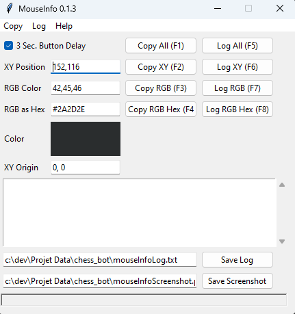
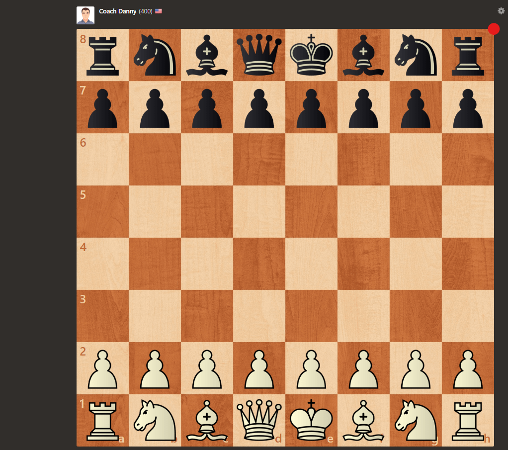
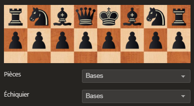
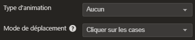
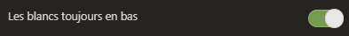

# Projet-Data

## Installation des dépendances

1. Ouvrez une invite de commande ou un terminal dans le répertoire racine de votre projet.
2. Vérifiez que vous avez bien le fichier "requirements.txt" dans votre répertoire racine en tapant la commande ls (pour les utilisateurs de Mac/Linux) ou dir (pour les utilisateurs de Windows).
3. Pour installer les dépendances, tapez la commande suivante dans votre invite de commande ou terminal:  
``pip install -r requirements.txt``
4. Appuyez sur Entrée. Le processus d'installation peut prendre quelques minutes.
5. Une fois l'installation terminée, vous pouvez vérifier que les dépendances ont été correctement installées en exécutant votre projet ou en utilisant une commande pour lister les paquets installés, telle que :  
``pip list``

## Récupération des coordonnées du plateau

Pour récupérer les coordonnées d'un plateau d'échecs en utilisant la bibliothèque Python "mouseinfo", vous pouvez suivre les étapes suivantes:  

1. Ouvrez votre éditeur de code Python préféré et ouvrez le fichier get_mouse_info.ipynb dans le doosier chess_bot.
2. Voici le contenu de ce fichier :  
```py
import mouseinfo
mouseinfo.MouseInfoWindow()
```
En exécutant cette commande cette fenêtre devrait apparaitre :  


3. Vous allez ensuite récupérer les coordonnées de votre plateau :  
    3. 1. L'abscisse et ordonnée trouvable à côté du label XY Position (X = abscisse et Y = ordonnée) :
    
    3. 2. Largeur du plateu, correspond à l'abscisse de cette position:  
    

## Configuration des paramètres de chess.com

Si vous avez décidé de jouer sur chess.com vous allez devoir configurer quelques paramètres sur votre partie. Pour faire celà vous devez cliquer sur la roue dentée juste en haut à droite de notre plateau. Une fois cela fait nous allons modifier quelques paramètres :

1. Affichage des pièces :  
Pour faciliter la reconnaissance des pièces nous allons utiliser cette affichage par défaut.  


2. Animation et déplacement :  
Pour permettre à notre script de jouer à notre place nous devons supprimer les animations et effectuer le déplacement des pièces avec des cliques.  


3. Position des blancs :  
Par défaut nous allons faire en sorte que les blancs soient toujours positionnés sur le bas du plateau.  


## Lancement du script 

Une fois les dépendances installées, les coordonnées du plateau récupérées et chess.com configuré, vous n'avez plus qu'à lancer cette commande : 

```
python .\chess_bot\chess_script.py -c color -x abscissa -y ordinate -w width
```

Les valeurs suivantes sont à remplacer : 
1. ``color`` doit être remplacé par "black" ou "whte" en fonction de la couleur que vous jouez.
2. ``abscissa`` doit être remplacé par l'adscisse récupérée sur le premier point
3. ``ordinate`` doit être remplacé par l'ordonnée récupérée sur le premier point
4. ``width`` doit être remplacé par l'adscisse récupérée sur le second point